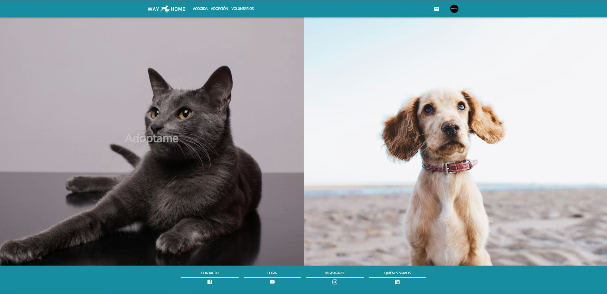
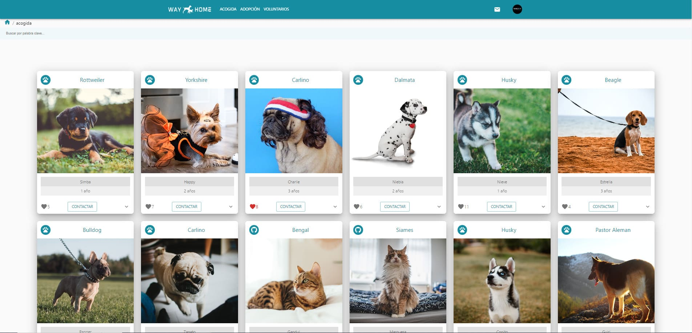
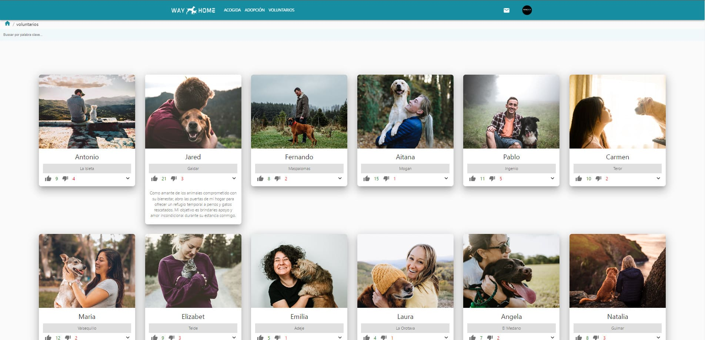
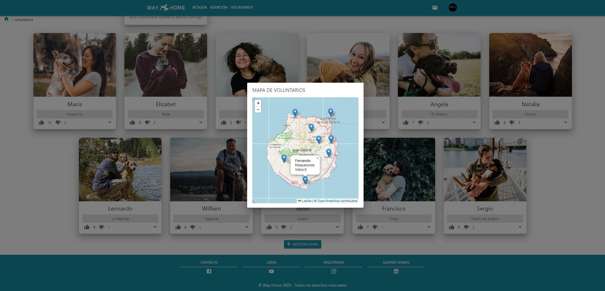
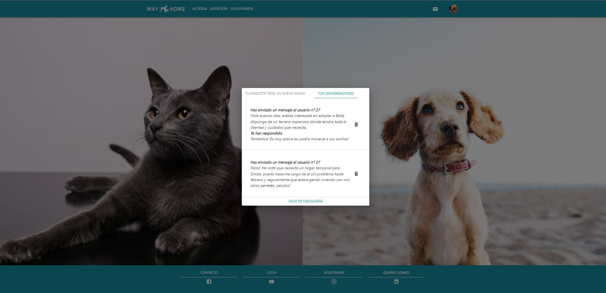

# 🐶🐱 WayHome

**WayHome** es una aplicación web que tiene como objetivo principal facilitar la interaccion entre usuarios que deseen poner en adopcion o acogida temporal a sus mascotas con voluntarios dispuestos a ello.

## 🚀 Tecnologías utilizadas

### 🧩 Frontend

### 🛠️ Backend

### 🗄️ Base de datos

### 🧰 Herramientas y control de versiones

## 🎯 Funcionalidades principales

- ⚙ Registro personalizado con posibilidad de elegir varios roles de usuario.
- 🐶 Panel personalizado de mascotas.
- ✉️ Mensajes directos entre usuarios.
- ⭐️ Pagina de voluntarios disponibles con rating individual y mapa de localizacion.
- 🐱 Pagina detallada de las mascotas con informacion e imagen personalizada y su estado actual.
- 🔍 Filtros varios.
- 🔒 Panel de control para administradores.

## 🖼️ Capturas de pantalla

## 👨‍💻 Autor

**Ebén González de la Cruz**

📧 ebencito88@gmail.com

🌐 https://github.com/EbenGonzalez

💼 https://www.linkedin.com/in/ebendev/
